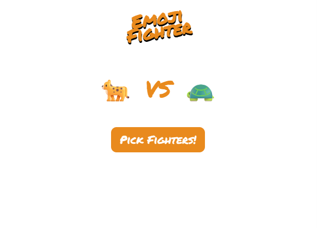

# 🥊 Emoji Fighter (JS project)

A playful, emoji-powered mini-game inspired by classic 1980s “Battlefield”-style combat. Random emojis face off in hilarious matchups — who will emerge victorious?

---

## 🌐 Live Demo

👉 **[Try the game live here](https://emoji-fighter-with-js.vercel.app/)**

---

## 📸 Preview

<p align="center">  
    
</p>  

---

## 📖 About

A retro-style emoji battle game created with HTML, CSS, and JavaScript — a fun throwback to pixel-era combat, reimagined with modern web tech.

---

## ✨ Features

* 🎲 Random emoji fighters face off every round
* 🎨 Clean, engaging visuals with dynamic emoji updates
* ⚡ Lightweight and fast — built using **HTML**, **CSS**, and **JavaScript** only

---

## 🛠️ How It Works

1. Open `index.html` in your browser to launch the game.
2. Click the **“Fight!”** button to randomly select two emoji combatants.
3. Emojis update dynamically to show a new battle each time.
4. No external libraries or frameworks required.

---

## 📂 Project Structure

```plaintext
emoji-fighter-with-js/
├── index.html
├── index.js
├── index.css
├── output-emojifighter.png
└── LICENSE
```

---

## 🧰 Technologies Used

* **HTML5** – Structure
* **CSS3** – Styling & layout
* **JavaScript (ES6+)** – Game logic & interactivity

---

## 📜 License

This project is licensed under the **MIT License** — free to use and modify.

---

## 👤 Author

Made with ❤️ by **srcastt**
👉 [GitHub Profile](https://github.com/srcastt)

---

